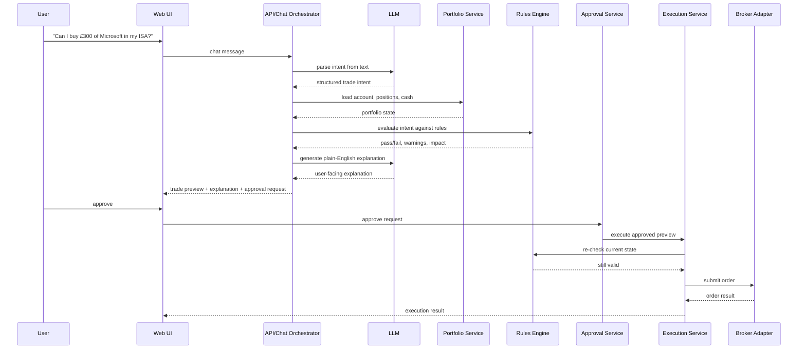

# Butr MVP Architecture

## 1. Product goal

Butr is a calm, AI-native investing copilot for UK retail investors. The MVP should help users understand their portfolio, preview trades, and execute approved actions safely through Trading 212, with special attention to Stocks & Shares ISA constraints and investor intent clarity.

The product should feel like a control layer above the broker:

- chat-first
- explainable
- approval-first
- ISA-aware
- deterministic at the backend

## 2. Recommended repo structure

Start with a repo organized around four high-level buckets: `infra`, `services`, `platform`, and `tests`.

```text
.
├── infra
│   ├── terraform
│   ├── migrations
│   ├── env
│   └── deploy
├── services
│   ├── api
│   │   ├── src
│   │   │   ├── modules
│   │   │   │   ├── chat
│   │   │   │   ├── portfolio
│   │   │   │   ├── approvals
│   │   │   │   ├── execution
│   │   │   │   └── auth
│   │   │   ├── routes
│   │   │   ├── jobs
│   │   │   └── main.ts
│   │   └── test
│   ├── broker-adapters
│   │   ├── src
│   │   │   ├── broker-adapter.ts
│   │   │   ├── trading212
│   │   │   └── mocks
│   │   └── test
│   ├── rules-engine
│   ├── execution
│   ├── llm
│   └── tests
├── platform
│   ├── web
│   │   ├── app
│   │   ├── components
│   │   ├── features
│   │   │   ├── chat
│   │   │   ├── portfolio
│   │   │   ├── trade-preview
│   │   │   └── audit-log
│   │   └── lib
│   └── domain
│       ├── src
│       │   ├── account.ts
│       │   ├── instrument.ts
│       │   ├── position.ts
│       │   ├── order.ts
│       │   ├── allocation.ts
│       │   ├── trade-intent.ts
│       │   ├── trade-preview.ts
│       │   ├── approval-request.ts
│       │   ├── execution-result.ts
│       │   └── portfolio-rules.ts
│       └── index.ts
├── tests
│   ├── integration
│   ├── e2e
│   └── fixtures
└── docs
```

Why this shape works:

- `platform/domain` keeps the product vocabulary explicit and typed
- `services/broker-adapters` makes Trading 212 just one implementation behind a stable interface
- `services/rules-engine` stays deterministic and testable
- `services/execution` handles safety, approvals, retries, and idempotency
- `services/llm` is kept separate so language work never leaks into source-of-truth logic
- `tests` is a first-class home for integration and end-to-end coverage

## 3. Core domain models

These are the types that should exist early and be shared across backend and frontend.

### Account

Represents a brokerage account such as a Stocks & Shares ISA or General Investment Account.

Key fields:

- `id`
- `broker`
- `accountType` (`isa`, `gia`, `sipp`, etc.)
- `currency`
- `status`
- `availableCash`
- `marketValue`
- `unrealizedPnL`
- `createdAt`
- `updatedAt`

### Instrument

Represents a tradeable asset.

Key fields:

- `symbol`
- `isin`
- `name`
- `assetClass`
- `currency`
- `exchange`
- `tradingStatus`

### Position

Represents a holding in an account.

Key fields:

- `instrumentId`
- `accountId`
- `quantity`
- `averageCost`
- `marketPrice`
- `marketValue`
- `weight`
- `unrealizedPnL`

### Order

Represents a historical or active broker order.

Key fields:

- `id`
- `accountId`
- `instrumentId`
- `side` (`buy`, `sell`)
- `type` (`market`, `limit`)
- `status`
- `quantity`
- `limitPrice`
- `filledQuantity`
- `filledPrice`
- `submittedAt`
- `updatedAt`

### Allocation

Represents a portfolio view useful for chat and rules.

Key fields:

- `accountId`
- `holdings[]`
- `sectorBreakdown[]`
- `assetClassBreakdown[]`
- `cashWeight`
- `topPositions[]`

### TradeIntent

Represents what the user wants to do before any checks.

Key fields:

- `id`
- `userId`
- `accountId`
- `action` (`buy`, `sell`, `rebalance`, `mirror`, `set-target`)
- `instrumentRef`
- `amount`
- `quantity`
- `targetWeight`
- `constraints`
- `sourceText`
- `parsedAt`

### TradePreview

Represents the deterministic outcome of evaluating the intent.

Key fields:

- `id`
- `tradeIntentId`
- `accountId`
- `proposedOrders[]`
- `estimatedCosts`
- `estimatedImpact`
- `ruleChecks[]`
- `warnings[]`
- `requiresApproval`
- `expiresAt`

### ApprovalRequest

Represents a specific user decision gate.

Key fields:

- `id`
- `tradePreviewId`
- `status` (`pending`, `approved`, `rejected`, `expired`)
- `requestedAt`
- `decidedAt`
- `decisionBy`

### ExecutionResult

Represents what actually happened after approval.

Key fields:

- `id`
- `approvalRequestId`
- `status`
- `brokerOrderIds[]`
- `submittedAt`
- `completedAt`
- `errorCode`
- `errorMessage`

### PortfolioRule

Represents a deterministic guardrail.

Examples:

- max position weight
- max cash deployment per trade
- no trades in restricted instruments
- ISA-specific availability checks
- minimum cash buffer

## 4. Backend service boundaries

Keep the backend modular even if it starts as a single deployable service.

### API gateway / BFF

Responsible for:

- auth/session handling
- chat endpoints
- portfolio endpoints
- preview endpoints
- approval endpoints
- audit log retrieval

### Chat orchestration

Responsible for:

- accepting user text
- calling the intent parser
- selecting the right portfolio data
- asking the rules engine for deterministic evaluation
- formatting the response back to the user

### Portfolio service

Responsible for:

- account summaries
- positions
- orders
- allocation calculations
- state caching and refresh

### Broker adapter service

Responsible for:

- broker authentication
- broker API calls
- normalizing raw broker payloads into domain types
- hiding broker-specific quirks behind a stable interface

### Rules engine

Responsible for:

- validating trade intent against account state
- checking ISA-aware constraints
- computing portfolio impact
- producing structured warnings and failures

### Approval service

Responsible for:

- creating approval requests
- tracking pending decisions
- idempotency
- expiry handling

### Execution service

Responsible for:

- re-validating before submit
- submitting orders through the broker adapter
- persisting execution results
- handling retries and partial failures safely

### Audit service

Responsible for:

- immutable action history
- request/response logging
- rule-check history
- execution trail

## 5. Chat-to-trade request flow

This is the critical user journey and should stay deterministic.



### Flow rules

1. The LLM may parse the user's request into structured intent.
2. The backend must validate the parsed intent before any preview or execution.
3. The rules engine must run before preview.
4. Approval is required before any broker submission.
5. Execution must re-check account state in case anything changed while the user was deciding.
6. Every step should be auditable.

## 6. Safest MVP scope

The safest buildable MVP is narrower than the full vision.

### In scope

- Trading 212 account connection
- read-only portfolio sync
- account summary
- positions
- recent orders
- cash balance
- portfolio allocation calculations
- chat-based portfolio questions
- simple buy/sell intent parsing
- trade preview generation
- explicit approve/reject flow
- order execution after approval
- audit trail

### Out of scope for V1

- autonomous recurring strategies
- full rebalance automation
- multi-broker support
- options/derivatives
- tax reporting
- advanced factor analytics
- social/mirroring marketplace
- market data research terminal
- broad financial planning

### Important MVP guardrails

- only one broker at launch
- only a small set of action types
- only approved actions can execute
- cap single-trade exposure
- enforce a cash buffer
- always show human-readable impact before execution
- fail closed when data is stale or incomplete

## 7. Recommended tech stack

For a web-first product, I would bias toward a TypeScript monorepo.

### Frontend

- `Next.js` for the web app
- `React` with server components where useful
- `Tailwind CSS` plus a light design system layer
- `shadcn/ui` or a similarly composable component approach
- `TanStack Query` for server state
- `Zustand` only if local interaction state becomes complex

### Backend

- `Node.js` + `TypeScript`
- `Fastify` or `NestJS` for a structured API layer
- `PostgreSQL` for persistence
- `Prisma` or `Drizzle` for typed data access
- `Redis` for caching, locks, and short-lived approval state
- background jobs via `BullMQ`, `Temporal`, or a simple queue if the MVP stays small

### LLM / orchestration

- structured tool calling
- JSON schema validation
- deterministic backend validators
- prompt templates stored in code

### Infra

- Docker for local parity
- Vercel for web if you want fast iteration
- Fly.io, Railway, or a small container host for the API
- managed Postgres

### Observability

- structured logs
- request IDs
- audit events
- error tracking from day one

## 8. Phased implementation plan

### Phase 0: Foundations

Goal: establish the product vocabulary and safe architecture.

- create monorepo
- define domain models
- define broker adapter interface
- define rules engine interface
- define approval/execution contracts
- set up linting, formatting, CI, test harness

### Phase 1: Read-only portfolio copilot

Goal: users can connect Trading 212 and ask questions safely.

- auth and account connection
- sync account summary, positions, and orders
- portfolio allocation calculations
- chat UX for portfolio questions
- plain-English explanations
- audit log

### Phase 2: Trade preview

Goal: the system can reason about a proposed trade without executing it.

- parse buy/sell requests
- resolve instruments
- validate against rules
- calculate portfolio impact
- render preview card
- create approval request

### Phase 3: Approval and execution

Goal: approved trades can be submitted safely.

- explicit approve/reject actions
- revalidation at execution time
- broker order submission
- execution result tracking
- failure handling and retry policy

### Phase 4: Hardening

Goal: make the MVP trustworthy.

- stale data detection
- stronger safety limits
- better audit detail
- idempotency everywhere
- alerting and operational dashboards
- broker adapter cleanup for future brokers

### Phase 5: Expansion

Goal: prepare for broader use without breaking the core design.

- additional brokers
- more sophisticated rules
- portfolio insights
- recurring intent templates
- watchlists and notifications

## 9. Practical implementation guidance

If we want this to stay buildable, a few choices matter early:

- keep all broker calls behind one adapter interface
- keep trade evaluation synchronous and deterministic where possible
- treat LLM outputs as suggestions that must be validated
- store previews and approvals separately from execution results
- design every trade flow to be replayable and auditable

## 10. Suggested first milestone

Build the smallest version that can do this:

1. connect a Trading 212 account
2. load account state
3. answer "what do I own?" and "what am I overweight in?"
4. parse "buy £300 of Microsoft"
5. generate a trade preview with rule checks
6. require explicit approval
7. submit the order
8. record the full audit trail

That is already a real product, and it establishes the exact architecture Butr needs to grow safely.
